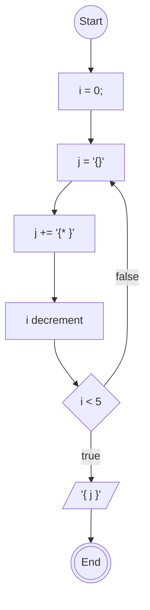

```mermaid
flowchart

mulai@{ shape: circle, label: "Start"}
i@{ shape: rect, label: "i = 0;"}
j@{ shape: rect, label: "j = '{}'"}
do@{ shape: rect, label: "j += '{* }'"}
i+@{ shape: rect, label: "i decrement"}
loop@{ shape: diamond, label: "i < 5"}
hj@{ shape: lean-r, label: "'{ j }'"}
selesai@{ shape: doublecircle, label: "End"}

mulai-->i-->j-->do-->i+-->loop--true-->hj-->selesai
loop--false-->j

```
