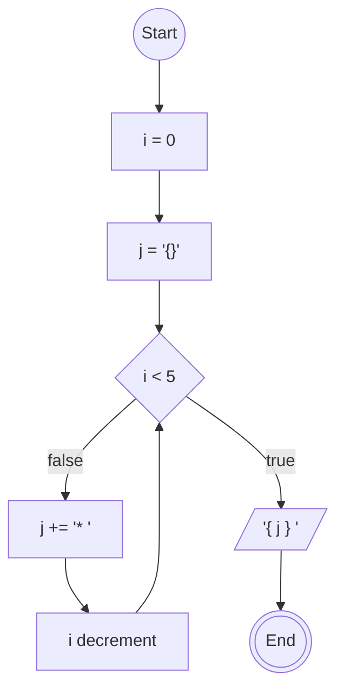

```mermaid
flowchart

mulai@{shape: circle, label: "Start"}
i@{ shape: rect, label: "i = 0"}
j@{ shape: rect, label: "j = '{}'"}
loop@{ shape: diamond, label: "i < 5"}
j+@{ shape: rect, label: "j += '* '"}
i+@{ shape: rect, label: "i decrement"}
hj@{ shape: lean-r, label: "'{ j } '"}
selesai@{ shape: doublecircle, label: "End"}

mulai-->i-->j-->loop--false-->j+
loop--true-->hj-->selesai
j+-->i+-->loop

```
